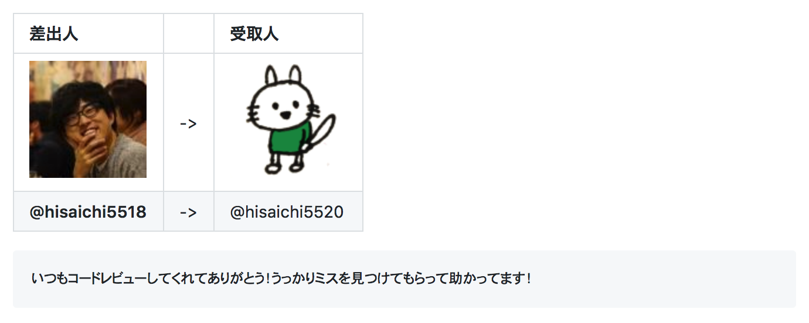

# otegami


## メンバーを追加する

`.otegami.yml`に対象者のSlack IDを`members`に追加する

```yml
members:
  - hisaichi5518
  - hisaichi5519
  - hisaichi5520
```

## お手紙を送る相手を決める

```
@otegamibot notify groups
```

誰が誰に手紙を書くのかが、それぞれDMで送られます。


## お手紙を保存する

各々がbotへのDMで行います。

```
@otegamibot save <保存したい内容>
```

具体的には以下のように行います。

```
@otegamibot save いつもコードレビューしてくれてありがとう！うっかりミスを見つけてもらって助かってます！
```

## お手紙の結果を送る

```
@otegamibot notify result
```

以下のような結果が書かれたイシューが立てられる。


